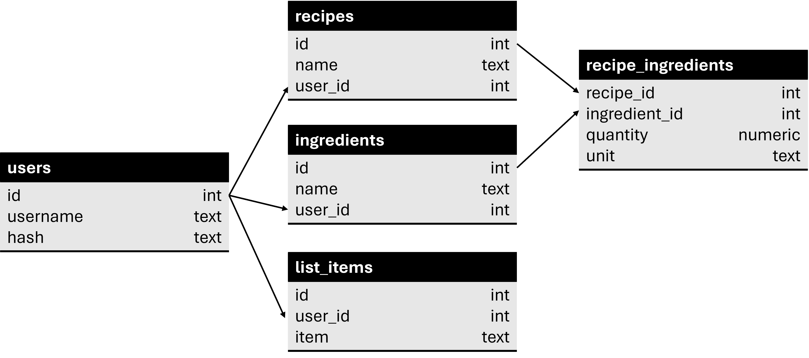

# Chef's Choice
#### Video Demo:  <URL HERE>


#### Brief description and objectives:
Hello world! I am proud to present my final project for the CS50x course. This project embodied almost everything that I learned across the course and even more!
Chef's Choice is a web application (Flask) that allows the user to have an application that selects the meal or weekly menu plan for them.
The idea came to me when I was having an "argument" with my girlfriend for what we were going to dinner on that day, as we were inclined to push the decision of what to eat onto each other.
I know that the challenge of the final project was to (maybe) change the world but I am starting small and changing my home for better, settling an argument for once and for all.


### Running the Program

Before running the application for the first time, use `pip` to resolve the dependencies:

```shell
$ pip install -r requirements.txt
```


Then, run the application:
```shell
$ flask run
```


### What each of the files contains and does?

- `app/`:  
  - `app.py`: Main application to initiate Flask. It contains all the main routes and features of the application that will be further entailed below.
  - `helpers.py`: Helper function to decorate routes to require login (based on PSet9 of CS50x). 

- `chefchoice.db`: Database that stores ingredients and recipes of each user individually.

- `static/`: Contains the CSS stylesheet of the application and the image used for this application.

- `templates/`: Under templates there are the html files for the web app. With the `layout.html` being the base of all others.

#### Database
The following database relationship diagram resumes how the database works:


With this relationship it is possible for each user to have its own database of ingredients and recipes. It was hypothesized to have global databases of ingredients and recipes in order to have more diversity but in the end it was decided to keep it individual to be more personalized.
list_items table is used to temporarily save weekly plans for each user.

### Features

The webapp was designed in order to each user develop its own cooking portfolio. with that portfolio it is then possible to generate a random recipe for a meal or a weekly plan of random recipes in order for the user not having to decide what to eat.

Basic features include:
- `Register`;
- `Login`;
- `Logout`;
- `Change password`.

Advanced features include:
- `Ingredients`: This tab allows the user to add or remove ingredients to its portfolio.
- `Add Recipe`: This tab allows the user to create recipes with the ingredients, quantity and units as desired, from the users portfolio. This tab is dinamically updated allowing user to see the recipe in construction with the possibility to remove ingredients that were incorrectly introduced.
- `Recipes`: Tab for the user to query existing recipes in its portfolio. User also has the possibility to remove recipes that they do not wnat to be in its portfolio.
- `Meal Decider`: The randomizer of meals. It is the main feature of this app, allowing the user for the "chef" to choose a random plate from the portfolio. It also has the feature to generate new random meals from the remaining meals if the user does not want that plate.
- `Weekly Planer`: An enlarged version of the randomizer. The user may generate a full 14-plate weekly plan from its portfolio. It has the functionality of redrawing the plan. Further features include the possibility of dragging meals to rearrange to user's preference and save to show later in the `Weekly Plan` tab. After drawing the weekly plan, this tab also generates a grocery list, which is based on all 14 recipes with a printing in pdf possibility. This allows the user to have the week all planned out including a list of what to buy in the market.

### Final remarks, lessons learned and future work:
This project started as something simple in my head but it quickly escalated. I learned how to not underestimate what might seem simple. 
Much of the functionalities that I projected in the beggining I ended up not creating them as I was dedicating too much time and I want to dedicate to learn other languages before going more in-depth here. I ended making a MVP (minimum viable product) to finish this course. Some functionalities that are to be implemented in the future are for example: 
- Develop `weekly planner` to allow the user to replace some meals manually (getting options that were not originally generated).
- Enhance the randomizer to select a meal based on the ingredients/leftovers that the user has.
- Work on a global basis database of ingredients and recipes and then allow user to personalize the portfolio.
One day I will get back to this project to further enhance it, but for now it fullfills my needs.
I've also ended up dealing with a lot more JavaScript than I intended originally. Had to learn in order to develop draggability function in the `weekly planner` and to use JQuery library to learn how to make a page dinamically update and comunnicate with backend (got to admit that I had some of help of AI to make that last part work in 100%).
This project ended being perfect to end this course: being challenging and touching almost every topic that was studied throughout the course, while learning how to better manage expectations, frustations and growing as a person with the programming tool on its toolbelt to solve further challenges that may arise in my future.
This was CS50!# CS50xFinalproject
